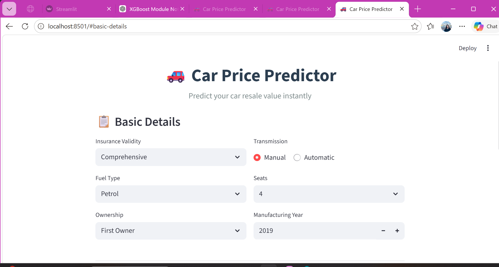
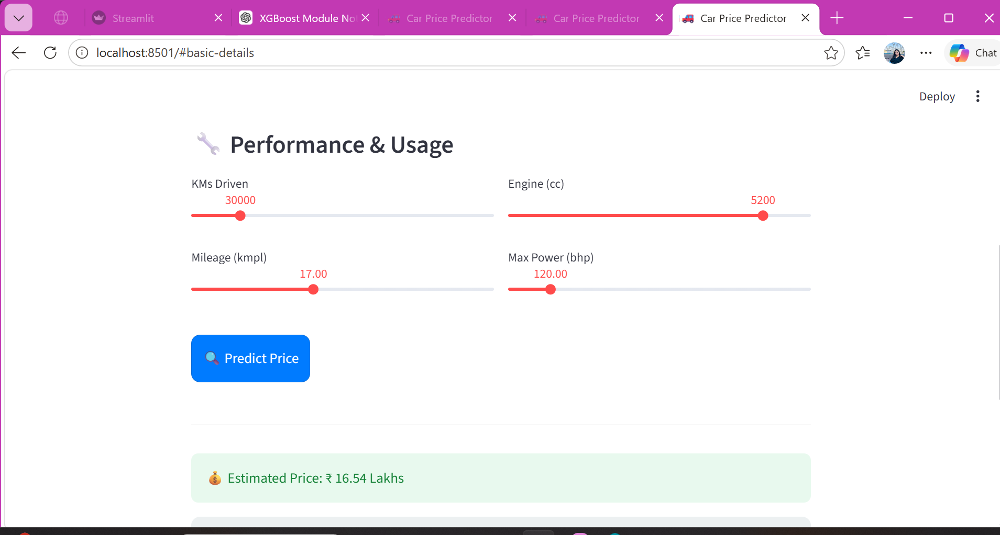
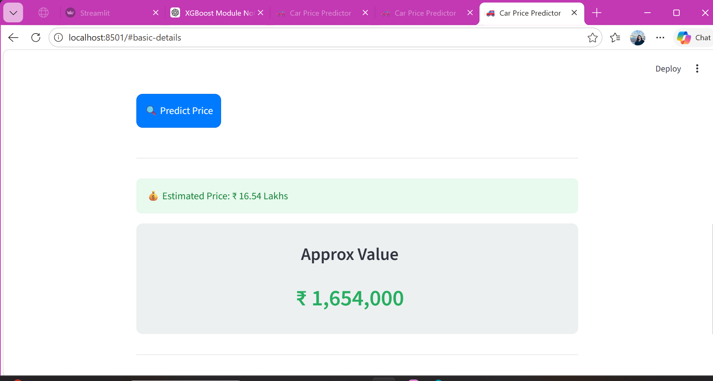

# 🚗 Car Price Prediction App

## 📌 Project Overview

The **Car Price Prediction App** is a Machine Learning-based web application that estimates the resale value of a car based on various features such as fuel type, mileage, engine capacity, ownership, and more.

The application is built using **Streamlit** and provides a modern, interactive, and user-friendly interface for real-time predictions.

---

## ✨ Key Features

* 🚗 Instant car price prediction
* 🎨 Premium UI (gradient + glassmorphism design)
* ⚡ Fast and responsive interface
* 📊 Real-time ML-based predictions
* 📱 Simple and user-friendly inputs

---

## 🛠️ Tech Stack

* **Language:** Python
* **Frontend:** Streamlit
* **Libraries:** NumPy, Scikit-learn, XGBoost
* **Model:** Machine Learning Regression Model

---

## 📥 Input Parameters

The model uses the following inputs:

* Insurance Validity
* Fuel Type
* Ownership
* Transmission Type
* Number of Seats
* Manufacturing Year
* Kilometers Driven
* Mileage (kmpl)
* Engine Capacity (cc)
* Maximum Power (bhp)

---

## 📤 Output

* 💰 Predicted car resale price (in Lakhs)
* 💵 Approximate value in Indian Rupees

---

## 🧠 Machine Learning Model

* Trained on a car dataset
* Uses regression techniques (e.g., XGBoost)
* Optimized for better prediction accuracy

---

## ▶️ How to Run Locally

1. Clone the repository

```bash
git clone https://github.com/arshitasikaria/car-price-prediction-app.git
```

2. Navigate to the project folder

```bash
cd car-price-prediction-app
```

3. Install dependencies

```bash
pip install -r requirements.txt
```

4. Run the application

```bash
streamlit run app.py
```

---

## 📸 Screenshots

*Add your application screenshots here*





---

## 📁 Project Structure

```bash
car-price-prediction-app/
│── app.py
│── model.pkl
│── model.ipynb
│── README.md
```

---

## 👩‍💻 Author

**Arshita Sikaria**
MCA Student | Aspiring Data Scientist

---

## 🔮 Future Enhancements

* Add graphs and visual insights
* Improve model accuracy
* Add more car features
* Optimize UI for mobile devices

---

## 🙌 Acknowledgements

* Open-source datasets
* Python ML libraries
* Streamlit for building the UI

---

⭐ If you like this project, feel free to star the repository!
